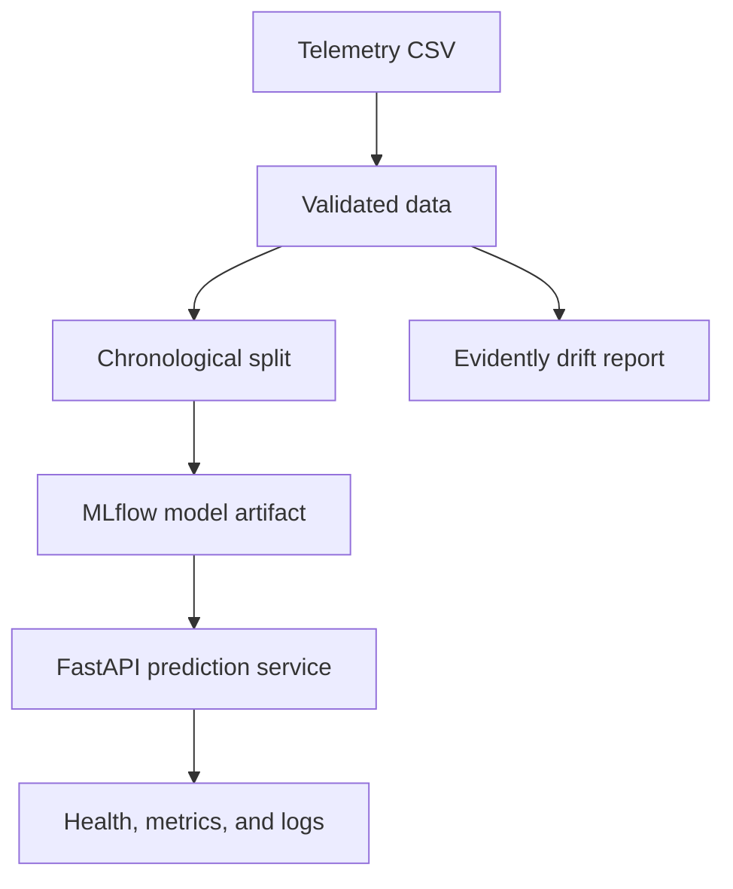
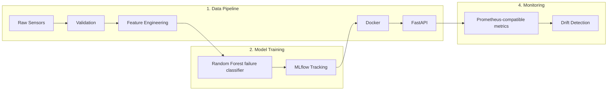

# MachSense AI: Predictive Maintenance MLOps

An incremental predictive-maintenance service for industrial telemetry and machine-failure classification.

The current repository trains a scikit-learn random-forest classifier on the UCI AI4I 2020 dataset, logs runs to MLflow, orchestrates training with Prefect, serves predictions with FastAPI, and provides an Evidently drift-report helper. It does not claim production security, measured business outcomes, Kubernetes deployment, or a fully managed model registry.

---

## 📌 Objective

The goal of this project is to create a predictive maintenance system that analyzes sensor data from industrial equipment to forecast potential failures before they happen. This system helps reduce downtime, optimize maintenance schedules, and save operational costs.

## 🎯 Project Objectives
This predictive maintenance solution addresses critical industrial operational challenges through machine learning and MLOps best practices:

**Core Value Propositions:**

1. **Failure Prevention**
    - Estimate machine-failure risk from equipment telemetry.
    - Support condition-based maintenance decisions after domain validation.

2. **Maintenance Optimization**
    - Provide a model-serving foundation for maintenance prioritization.

3. **Operational Intelligence**
    - Track model version, inference latency, and service health.

**Technical Success Metrics:**
| Metric | Target | Measurement Protocol |
|--------|--------|----------------------|
| Validation metric | Reported by each training run | Dataset-specific evaluation |
| Inference latency | Exposed per prediction | Measure with representative load |
| Retraining frequency | Not automated | Define after drift policy is approved |


## 🏗️ Technical Architecture


## ⚙️ End-to-End MLOps Pipeline

<div style="display: grid; grid-template-columns: 1fr 1fr; gap: 20px; align-items: start;">

<div>
   
## Architecture Diagram


---

## 🗂️ Project Structure

```bash
predictive-maintenance-mlops/
├── README.md                   # Project documentation
├── requirements.txt            # Project dependencies
├── Makefile                    # Utility commands for development and deployment
├── .pre-commit-config.yaml     # Pre-commit hooks
├── src/
│   ├── model_training.py       # Validated AI4I failure classification
│   └── monitoring.py            # Evidently drift report helper
├── flows/
│   └── prefect_pipeline.py     # Workflow orchestration using Prefect
├── deployment/
│   ├── main.py                 # FastAPI app for online inference
│   ├── Dockerfile              # Docker container specification
│   └── terraform/              # GCP infrastructure as code (IaC)
├── tests/
│   ├── test_training.py        # Unit tests for training
│   └── test_inference.py       # Unit tests for inference
└── .github/workflows/ci-cd.yml # GitHub Actions for CI/CD
```

---

## 📊 Dataset

The bundled `data/ai4i2020.csv` is the UCI AI4I 2020 predictive-maintenance dataset. Each record includes:

- Machine type (`L`, `M`, or `H`)
- Air and process temperature
- Rotational speed, torque, and tool wear
- Binary `Machine failure` target

Identifiers and failure-mode indicator columns are intentionally excluded from the model to avoid leakage.

---

## 🤖 Modeling

The current implementation predicts `Machine failure` using:

- **RandomForestClassifier** with balanced class weights
- One-hot encoding for `Type`
- Stratified validation with a fixed seed
- Accuracy, precision, recall, and ROC AUC

Training validates the AI4I schema, rejects unexpected target values and missing sensor data, and logs parameters, metrics, and the model artifact to MLflow. Model promotion and registry governance are planned, not currently implemented.

---

## 📈 Experiment Tracking

We use **MLflow** to track our experiments:

- Log model parameters, metrics, and artifacts
- Save trained models for reproducibility
- Use MLflow Model Registry for versioned artifacts and controlled promotion
- Keep registry promotion explicit; no trained model is automatically promoted to production

Launch the MLflow UI locally with the SQLite backend:

```bash
mlflow ui --backend-store-uri sqlite:///mlflow.db --port 5000
```

### MLflow Model Registry configuration

The training pipeline reads registry and tracking configuration from environment variables and never hardcodes private URLs or credentials.

```bash
export MLFLOW_TRACKING_URI="sqlite:///mlflow.db"
export MLFLOW_REGISTRY_NAME="MachSenseFailureClassifier"
export MLFLOW_REGISTRY_ALIAS="staging"
```

For a remote tracking server, set `MLFLOW_TRACKING_URI` to the server URI, for example:

```bash
export MLFLOW_TRACKING_URI="http://mlflow-tracking:5000"
```

> Do not commit credentials, tokens, or private server URLs to the repository.

### Register a model after training

```bash
python -c "from src.model_training import train_model; train_model('data/ai4i2020.csv')"
```

This records the run in MLflow, logs the trained model artifact, and attempts registry registration under the name `MachSenseFailureClassifier`. If the registry is unavailable, the run still completes locally and the registry step is reported as skipped instead of breaking the training job.

### Retrieve a specific registered model version

```bash
mlflow models list -m "MachSenseFailureClassifier"
mlflow models get-versions --name "MachSenseFailureClassifier"
```

Or, to resolve a specific version by alias:

```bash
mlflow mlflow models get-versions --name "MachSenseFailureClassifier"
```

If you want to promote an approved model explicitly, update the alias only after validation:

```bash
mlflow set-model-alias --model-name "MachSenseFailureClassifier" --version <VERSION> --alias production
```

No training job automatically promotes a newly registered model to `production`.

---

## 🔁 Orchestration

The training pipeline is orchestrated with **Prefect**.

- Flow: data loading → validation/splitting → model training → evaluation → MLflow logging
- Scheduled deployment and Prefect Cloud operation are not verified in this repository.
- Easily monitor status and retries

Run the local flow with:

```bash
python -m flows.prefect_pipeline
```

---

## 🚀 Model Deployment

We deploy the trained model using a **FastAPI** web server:

- REST endpoint: `/predict`
- Input: JSON payload with telemetry features
- Output: failure classification, failure probability, model version, inference latency, and request ID
- Containerized using Docker
- Deployable to GCP or any container platform

Example request using the AI4I sensor contract:

```bash
curl -X POST http://localhost:8000/predict -H "Content-Type: application/json" -d '{"Type":"M","Air temperature [K]":298.1,"Process temperature [K]":308.6,"Rotational speed [rpm]":1551,"Torque [Nm]":42.8,"Tool wear [min]":0}'
```

The service also exposes `/health`, `/ready`, `/model/info`, and `/metrics`.

---

## 📉 Model Monitoring

Monitoring currently uses **Evidently** for drift reports and a small `/metrics` response for operational counters:

- Detects distribution changes when a reference and current dataset are supplied.
- Counts requests, predictions, and errors.
- Automated alerting and ground-truth performance monitoring are planned.

Metrics are exposed at `/metrics` for Prometheus scraping.

---

## ✅ Testing & CI/CD

Testing is implemented with **pytest**, and CI/CD with **GitHub Actions**.

- Unit tests for training and inference logic
- Linting with `flake8`, formatting with `black` and `isort`
- Pre-commit hooks for code quality
- CI pipeline runs on every push

---

## Deployment status

The Docker image builds from the repository root, runs as a non-root user, and has a health check. Terraform currently defines only an optional versioned GCS artifact bucket. Kubernetes and cloud promotion remain deferred until model delivery, secret handling, and operational tests are verified.

---

## ⚙️ Installation

Clone the repo and create a virtual environment:

```bash
git clone https://github.com/cssaritama/predictive-maintenance-mlops.git
cd predictive-maintenance-mlops
python -m venv venv
source venv/bin/activate
pip install -r requirements.txt
```

Set up the dependencies and run the training flow against the bundled AI4I data:

```bash
export DATA_PATH=data/ai4i2020.csv
python -m flows.prefect_pipeline
```

MLflow uses `sqlite:///mlflow.db` by default. Set `MLFLOW_TRACKING_URI` when using a separate tracking server or database.

---

## 🧪 Makefile Commands

```bash
make setup               # Install dependencies
make lint                # Run flake8, black, isort
make test                # Run all tests
make docker-build       # Build Docker container
make run                 # Run FastAPI app
python -m flows.prefect_pipeline  # Execute Prefect training flow
```

---

## 👨‍💻 Contributors

- Project Lead: [Carlos Saritama]
- Based on the [MLOps Zoomcamp 2025](https://github.com/DataTalksClub/mlops-zoomcamp)

---

## 📬 Feedback

<span style="color: #6e6e6e; font-size: 0.9em; font-style: italic;">

*Acknowledgments*: We extend our sincere gratitude to Alexey Grigorev and the DataTalks Club team for their expert guidance, valuable Slack support, and for creating this exceptional learning opportunity through the MLOps course.

</span>

---

## 📜 License

MIT License © 2025
