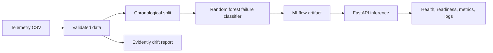

# MachSense AI Architecture

## Current state

MachSense AI is currently a small Python service for industrial telemetry and binary machine-failure classification using the UCI AI4I 2020 dataset.

Training is implemented in `src/model_training.py`, orchestration in `flows/prefect_pipeline.py`, serving in `deployment/main.py`, and drift reporting in `src/monitoring.py`.

## Boundaries

The project covers equipment health monitoring, failure-risk estimation, sensor validation, model training/evaluation, prediction serving, and operational monitoring. Fraud scoring, payments, chatbots, generic user management, feature-store ownership, and premature microservices/Kubernetes are out of scope.

## Planned evolution

The next safe additions are named sensor schemas, model metadata, durable prediction logging if justified, stronger evaluation, and CI security gates. Authentication applies only to future administrative/model-management operations. Cloud and Kubernetes deployment remain deferred until local Docker behavior is verified.